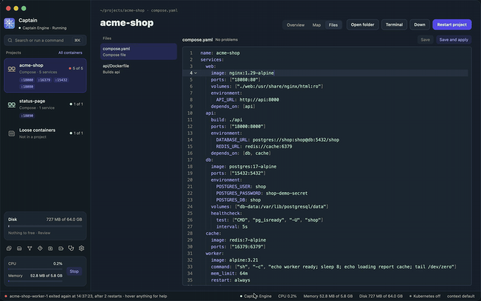
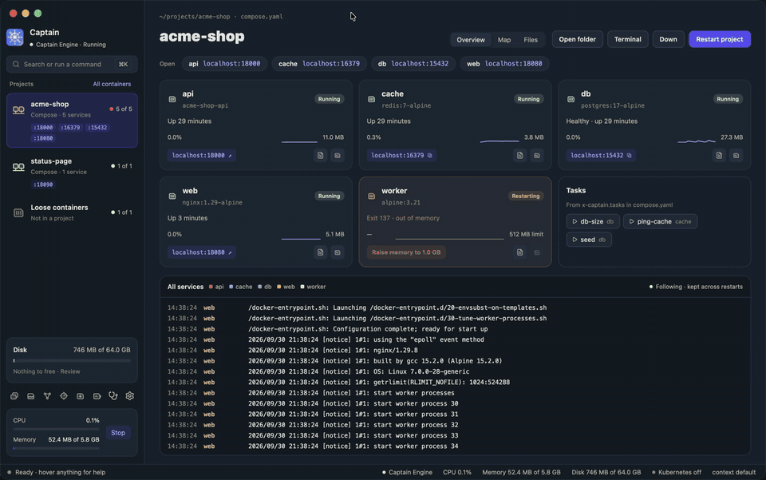
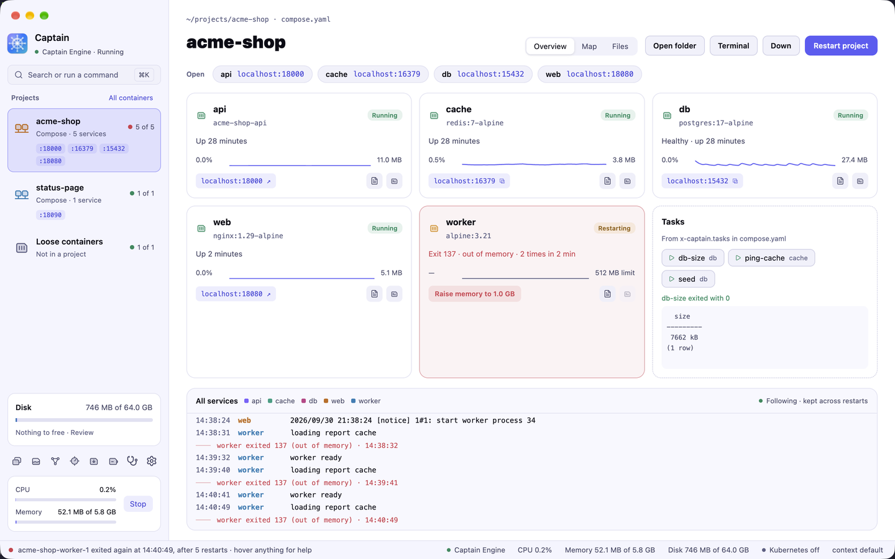
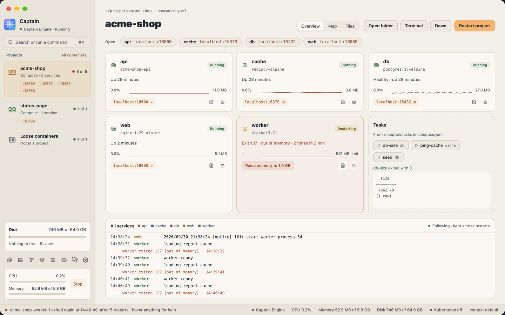
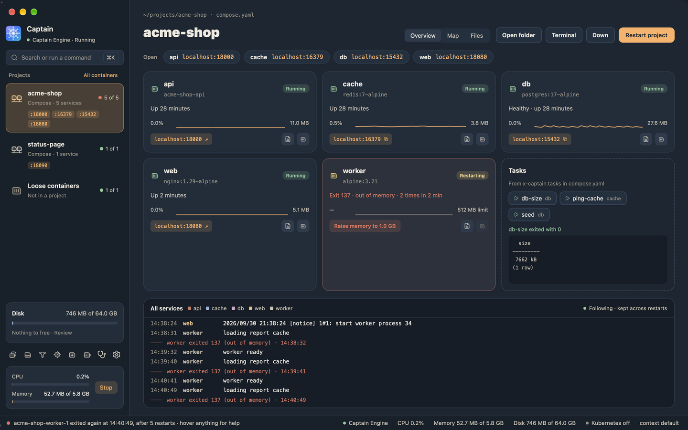

# Captain

A desktop app for Docker containers and Compose projects on macOS, written in Rust with [GPUI Kit](https://gpui-kit.com). It runs its own engine, so you do not need Docker Desktop or Rancher Desktop. Linux and Windows builds exist and connect to an engine you already run.


> Status: early development. There is no tagged release yet. See [ROADMAP.md](ROADMAP.md) for what works today.

To install and use Captain, read the [user guide](docs/guide/README.md). The rest of this file is for building Captain.

## What it does

- **Runs Docker for you.** Captain Engine is a small Linux VM with Docker that Captain sets up, starts, and stops. `Captain.app` carries `limactl`, the `docker` CLI, Compose, Buildx, `kubectl`, and `helm`, and can link them into your terminal.
- **Groups containers by project.** Each Compose project gets a page with its ports, its services, crash reasons, tasks from `x-captain.tasks`, and one log. See [Projects and tasks](docs/guide/projects-and-tasks.md).
- **Edits Compose files and Dockerfiles.** The Files tab checks the text as you type and shows which services a change recreates before it runs. See [Editing a project's files](docs/guide/editing-projects.md).
- **Runs commands from ⌘K.** Type `restart worker` or `logs db --since 10m`. See [The command palette](docs/guide/command-palette.md).
- **Frees disk space with a preview.** Storage shows what fills the engine disk and who uses each item, and removes only what you review. See [Storage](docs/guide/storage.md).
- **Lets AI agents read your projects.** `captain mcp` gives Claude Code, Codex, Cursor, and other agents read access, and only the actions you allow. See [AI agents](docs/guide/agents.md).

| Change a Compose file and preview it | Raise the memory of a crashed service |
|---|---|
|  |  |
| **Run commands from ⌘K** | **Free disk space** |
|  |  |

Captain has three themes, Dusk, Periwinkle, and Harbor, each light and dark:

| Periwinkle light | Harbor light | Harbor dark |
|---|---|---|
|  |  |  |

The screenshots show the demo project in [docs/demo](docs/demo/README.md).

## Build

You need Rust 1.98 or later. `rust-toolchain.toml` pins the version.

Platform requirements:

- macOS 15+ with Xcode Command Line Tools (`xcode-select --install`).
- Windows 10+ with Visual Studio 2022 Build Tools (Desktop C++ workload) and CMake.
- Linux (Ubuntu 24.04 example):

  ```sh
  sudo apt install -y gcc g++ clang libfontconfig-dev libwayland-dev \
    libwebkit2gtk-4.1-dev libxkbcommon-x11-dev libx11-xcb-dev \
    libssl-dev libzstd-dev vulkan-validationlayers libvulkan1
  ```

Then:

```sh
cargo run -p captain-app
```

To build `Captain.app` with the bundled tools on macOS, run `scripts/bundle-macos.sh release`. The script downloads the tools, checks their SHA-256 sums, and writes `target/release/Captain.app`.

## Which engine does Captain use?

By default Captain runs its own engine, **Captain Engine**: a small Linux VM with Docker that Captain starts, stops, and configures. On macOS it uses [Lima](https://lima-vm.io) 2.2 or newer. `scripts/bundle-macos.sh` puts `limactl`, the `docker` CLI, Compose, Buildx, the credential helper, `kubectl`, and `helm` in `Captain.app`, and Captain uses those first. A plain `cargo run` has no bundled tools, so it needs Lima on your `PATH` (`brew install lima`). The VM lives in `~/.captain/lima` and never touches your own Lima or Colima VMs. See [ADR 0008](docs/adr/0008-captain-engine.md) and [feature 0013](docs/features/0013-captain-engine.md).

On the first launch, Captain offers to set up Captain Engine or to use an engine you already have. You can switch at any time in Settings. With **Other engine**, Captain connects to an engine but does not control it. It checks these in order and uses the first one it finds:

1. The custom endpoint saved in Settings.
2. The `DOCKER_HOST` environment variable.
3. The current `docker context` (from `~/.docker/config.json`).
4. Known sockets for Docker Desktop, OrbStack, Colima, Rancher Desktop, and `/var/run/docker.sock`. On Windows it uses the `docker_engine` named pipe.

Other engine is the default when Lima is not installed, or when you saved a custom endpoint in an earlier version. On Linux, Captain uses the system `dockerd`.

## Project layout

| Crate | Purpose |
|-------|---------|
| `captain-core` | Domain models, the `Engine` trait, and state stores. No UI or Docker dependencies. |
| `captain-docker` | The `Engine` implementation for the Docker API, built on `bollard`. |
| `captain-host` | Captain Engine: the Lima VM on macOS, behind the `EngineHost` trait. |
| `captain-kube` | Kubernetes Services and port forwards, built on `kube-rs`. |
| `captain-terminal` | Terminal emulation for the exec terminal, behind an `Emulator` trait. |
| `captain-ui` | GPUI views. |
| `captain-app` | The binary. Opens the window and wires everything together. |
| `captain-cli` | The `captain` command: controls Captain Engine from the terminal, and runs `captain mcp`. |

Design decisions live in [docs/adr](docs/adr). Each feature has a short spec in [docs/features](docs/features).

## License

Licensed under either of [Apache License 2.0](LICENSE-APACHE) or [MIT](LICENSE-MIT), at your option.
