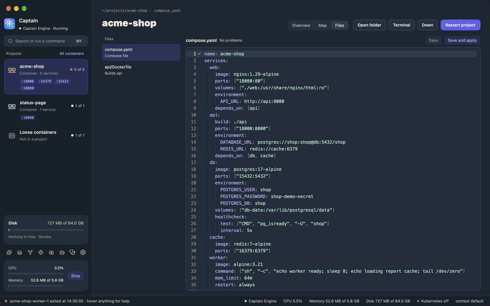
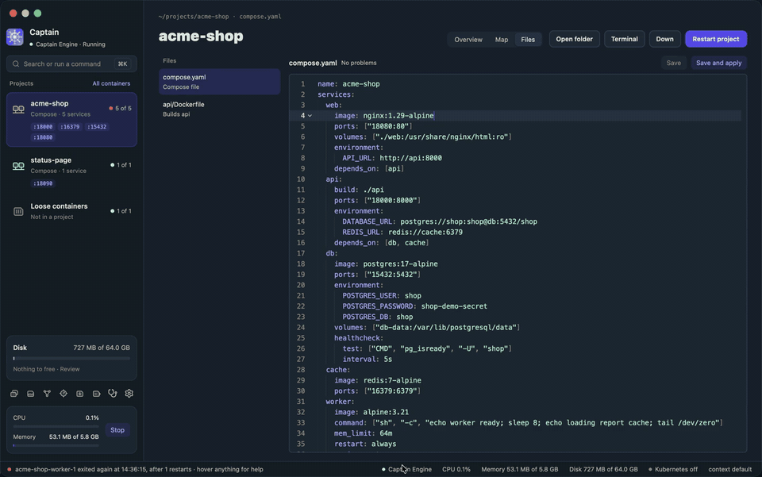
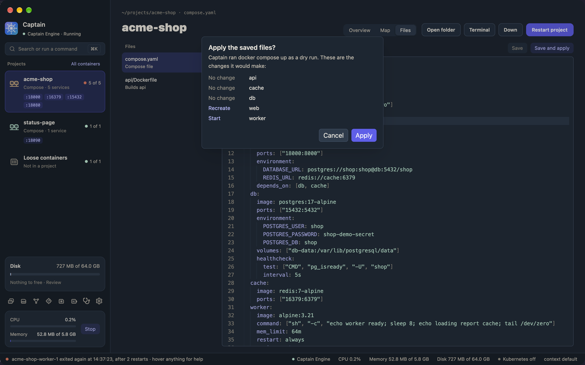

# Editing a project's files

The **Files** tab of a project page edits the project's Compose files and Dockerfiles inside Captain. Captain checks the text as you type and shows what a change will do before it runs anything. For bigger work, click **Open folder** in the project header and use your own editor.

The Files tab shows only for a Compose project. Kubernetes namespaces and loose containers have no files to edit.

## Which files you can edit

The list on the left has:

- The Compose files that Compose used for the project, in the order Compose read them.
- The Dockerfile of each service that builds from a folder in the project, with "Builds" and the service names. A Dockerfile that several services share shows once, with all their names.

Captain lists only files inside the folder Compose ran in. It does not open `.env` files. A service that builds from a remote context or from `dockerfile_inline` has no Dockerfile in the list.

## Edit and save

1. Open a project in the sidebar, then click **Files**.
2. Click a file in the list. It opens in the editor with line numbers and colors.
3. Edit the text. Press ⌘F to find text, and ⌘Z to undo.
4. Click **Save**.

The line above the editor shows the file name, "Unsaved" while you have changes, and the result of the checks. An orange dot in the list also marks a file with unsaved changes. Captain keeps the changes when you switch to another file, tab, or project.

Save keeps the file's permissions. If the file is a symlink, Captain writes to the file the link points to, and the link stays.

## When another program changes the file

Captain compares the file on disk with its copy every 2 seconds.

- If you have no unsaved changes, the editor loads the new text.
- If you have unsaved changes, a bar says "This file changed on disk." Click **Reload** to load the new text and drop your changes. Click **Keep mine** to keep your text. The next **Save** then replaces the file on disk.

Captain never overwrites a change from another program without this choice. If the file changed after you opened it, **Save** refuses and shows the bar. If Captain cannot read the file, for example because it was deleted, the bar offers **Reload** only.

## Checks as you type

When you stop typing, Captain checks the text you have, before you save:

- A Compose file goes through `docker compose config`, together with the project's other Compose files.
- A Dockerfile goes through Docker's build checks (`docker build --check`). Nothing is built.

While a check runs, the line above the editor says "Checking...". Then it says "No problems" or counts the errors and warnings.

Each problem shows on its line in the editor and in a list under it. Click a problem to move to its line. Red is an error that Compose or the build rejects. Orange is a warning: the file works, but the check advises a change. A base image that Captain cannot look up, for example one that needs a login, is a warning.

Compose reports some errors by key, not by line. Captain finds the key in the file. If it cannot, the problem shows on the nearest parent key. An error in another Compose file of the project has no line in this one.

The build checks need Docker Buildx 0.15 or later and an engine with Docker 27.1 or later. Captain Engine has both.

## Completion and help

In a Compose file, start typing a key. Captain offers the keys that Compose allows at that place, for example `healthcheck` under a service. Hover a key to see what it does. The list comes from the Compose schema of the Compose version that Captain bundles, plus Captain's own `x-captain` keys (see [Projects and tasks](projects-and-tasks.md)).

A Dockerfile has no completion.

## Save and apply

**Save and apply** saves a Compose file and then asks Compose what `docker compose up` would change, without changing anything (a dry run).

A dialog lists each service:

- **Recreate**: the service's settings changed, so Compose replaces its container.
- **Create**: a new service.
- **Remove**: a service that is no longer in the files.
- **Start**: a stopped service starts again.
- **No change**: the container stays as it is.

Images to pull or build show first. When no service changes, the dialog says "Nothing changes".

Click **Apply** to run `docker compose up -d --remove-orphans`, or **Cancel** to stop. The file stays saved either way. Compose's output goes to the project log on the **Overview** tab, tagged `compose`. A message says when Compose is done.

A dry run can hang when a service waits for another service to finish (`condition: service_completed_successfully`). Captain stops the preview after 60 seconds.

## Rebuild a service

A Dockerfile has a **Rebuild** button for each service that uses it, for example **Rebuild api**. It saves the file, builds the image again, and recreates the service's container (`docker compose up -d --build <service>`). A message says when the rebuild is done.

## Limits

- ⌘S does not save yet. Click **Save**.
- Completion covers Compose keys only. Captain does not complete values, such as image names or the service names in `depends_on`.
- Captain does not open `.env` files, or files outside the project folder.
- Captain does not show one merged view of a file and the files it `extends`. Each file opens on its own.
