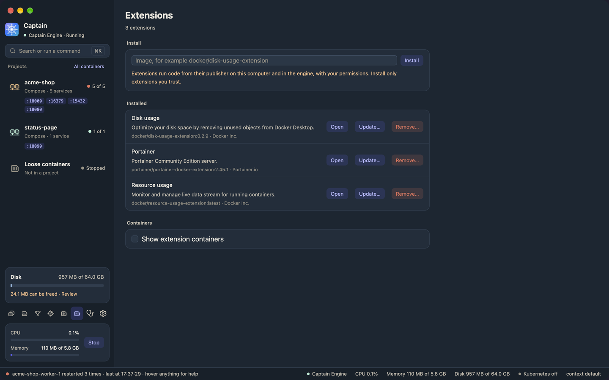
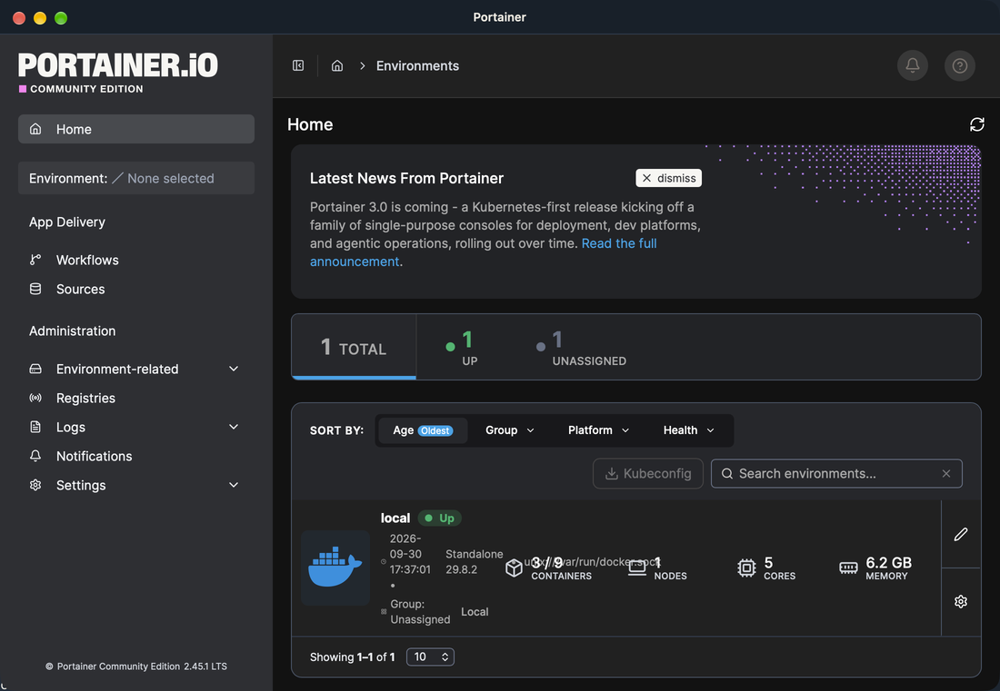
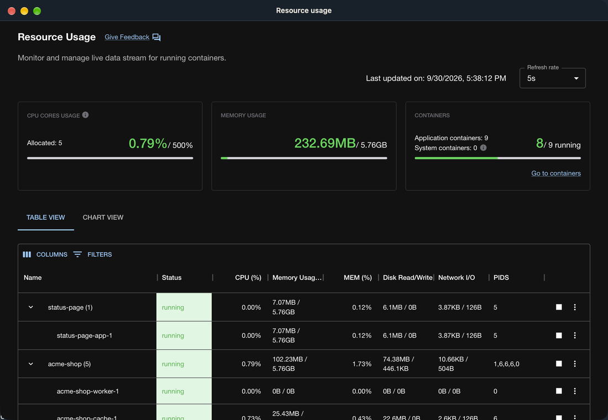

# Extensions

Captain runs Docker Desktop extensions. Each extension opens in its own window, and it talks to Captain the same way it talks to Docker Desktop.

You can install extensions on any engine, but their windows open only on macOS.

An extension runs code from its publisher on your Mac and in the engine, with your permissions. Install only extensions you trust.

## Install an extension

1. Click the Extensions button in the icon rail.
2. Enter the image, for example `docker/disk-usage-extension`.
3. Click **Install**, or press Return. Captain pulls the image.
   If you do not give a tag, Captain pulls the newest version tag, for example `0.2.9`. It uses `latest` only when no tag is a version.
4. Read the dialog. It shows the **Publisher**, the **Website**, whether it has a **Page**, its **Backend**, and any **Host binaries** that run on your Mac.
5. Click **Install**. Click **Cancel** to stop; Captain then removes the image it pulled.

If the install fails, Captain removes what it made, and the image if it pulled it.

The extension's files go in `~/.captain/extensions`. A backend runs as a Compose project in the engine.

## Extension containers

Captain hides the containers that run extension backends, as Docker Desktop does. They and their volumes and networks do not show in the sidebar, on the Containers, Volumes, and Networks pages, in the counts, in the menu bar, in ⌘K, or in the AI agent tools.

To show them, check **Show extension containers** on the Extensions page. Each backend then shows as a Compose project named `captain-ext-<id>`. The setting is `show_extension_containers` in the [settings file](settings.md).

Storage counts the images and volumes of a backend as in use, so a cleanup never removes them. The `docker` CLI lists extension containers either way.

Captain lists the extensions of the engine it is connected to.

## Open an extension

Click **Open**. The extension opens in its own window. Click **Open** again to bring the window to the front.

Some extensions, such as Portainer, show a page that their backend serves on `localhost`. The window loads that page once the backend runs.

A link in an extension to a container, an image, or a volume brings Captain's main window to the front and shows that item.

| Portainer, with its backend | Resource usage |
|---|---|
|  |  |

## Update an extension

1. Click **Update…**.
2. Captain looks up the newest version tag and fills in the **Tag** field. The dialog shows the installed image, and says when no newer version is published. You can enter another tag.
3. Click **Check**. If the image is the same, a message says the extension is up to date.
4. If a new image exists, the dialog shows both versions. Click **Update**.

The backend's volumes stay. If the update fails, Captain puts the old version back.

## Remove an extension

Click **Remove…** and confirm. Captain closes the window, removes the backend with its volumes, deletes the files, and removes the image.

## What works

Captain supports the common part of the Docker extension SDK: backend calls, `docker` and host commands, container and image lists, toasts, the file dialog, links to containers, images, and volumes in Captain, and opening links. A call that Captain does not support fails with "`<method>` is not supported by Captain". There is no marketplace. Install extensions by their image name.
