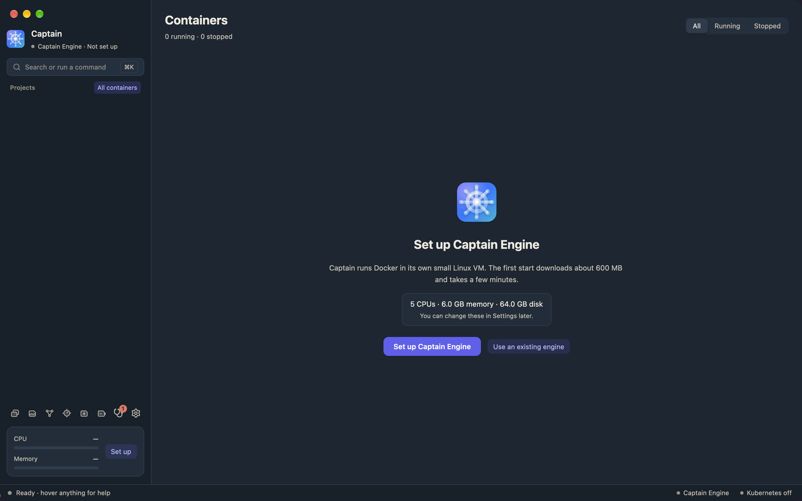
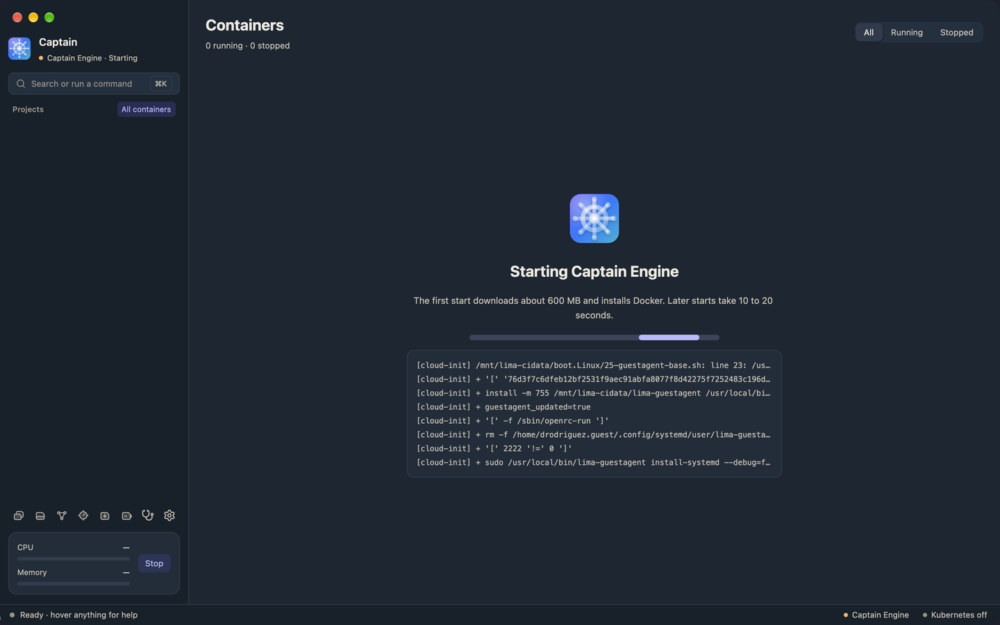
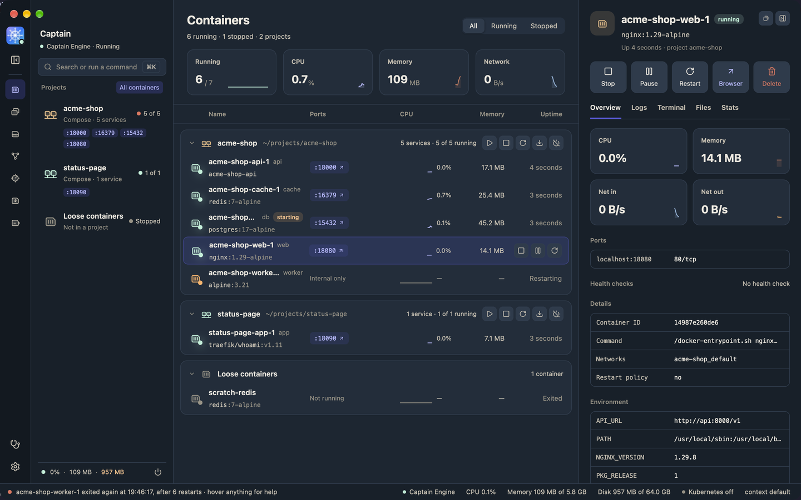

# Getting started

This page covers macOS. See [the guide index](README.md#platforms) for Linux and Windows.

## Install Captain

Captain needs macOS 15 or later.

### From a release

1. Open the [releases page](https://github.com/dantech2000/captain/releases).
2. Download `Captain-<version>-arm64.dmg`. Releases have an Apple silicon build only.
3. Open the `.dmg` and drag Captain to Applications.
4. If macOS says it cannot check the app, right-click Captain in Applications and choose **Open**. You can also allow it in System Settings > Privacy & Security. An unsigned build needs this once.

`Captain.app` carries Lima, the `docker` CLI, Compose, Buildx, the macOS credential helper, `kubectl`, `helm`, and the `captain` command. You do not need Homebrew.

### From source

If the releases page lists no release, or you use an Intel Mac, build the app yourself.

1. Install Rust and the Xcode Command Line Tools (`xcode-select --install`).
2. Clone the repository.
3. Run `scripts/bundle-macos.sh release`. The script downloads the tools, checks their SHA-256 sums, and builds the app.
4. Move `target/release/Captain.app` to Applications.

The tools need about 200 MB of disk. Without `release`, the script makes a debug build in `target/debug/Captain.app`.

## First launch

On the first launch, Captain shows the setup screen. It lists the CPUs, memory, and disk that Captain Engine gets. You can change them in Settings later.

1. If Captain finds another engine, such as Rancher Desktop or Docker Desktop, it lists it under **Other engines on this computer**. To copy its data after the setup, check **Bring your data along**. See [Moving from Docker Desktop or Rancher Desktop](moving-from-docker-desktop-or-rancher.md).
2. Click **Set up Captain Engine**. Captain downloads an Ubuntu image and creates the VM. The screen shows the progress.
3. Wait for the main window. The first start takes a few minutes. Later starts take 10 to 20 seconds.

To keep your current engine instead, click **Use an existing engine**. Captain then connects to that engine, but does not start or stop it.

If the start fails, the screen shows **Captain Engine did not start** and the error. Click **Try again**. Captain keeps what the first start downloaded. If the start fails again, see [Troubleshooting](troubleshooting.md).

Captain Engine lives in `~/.captain/lima`. It never touches your own Lima or Colima VMs.

### When the engine stops

When Captain Engine is stopped, the window shows **Captain Engine is stopped**. Click **Start**. The next launch of Captain also starts the engine.

When you quit Captain, Captain Engine stops, and its containers stop with it.

Before the VM shuts down, Captain stops Docker in the engine. Docker sends each container its stop signal and waits for its stop timeout (10 seconds unless the container sets another, for example `stop_grace_period` in Compose). Databases such as PostgreSQL shut down cleanly this way. Containers with the restart policy `always` or `unless-stopped` start again with the engine. This applies to Stop, Restart, Quit, and the stop before a snapshot or a restore. To keep the engine running after you quit, set `stop_engine_on_quit` to `false` in the [settings file](settings.md).

## The main window

The window has an icon rail at the far left, the sidebar next to it, the page on the right, and a status bar at the bottom. Press ⌘B to hide the sidebar, so the page gets the width. Press ⌘B again to show it.

### The icon rail

From top to bottom:

- **The app icon.** Click it to open Diagnostics, where you start, stop, or restart the engine. The engine's state shows in the status bar at the bottom of the window.
- **The sidebar button.** It hides the sidebar, or shows it again. The shortcut is ⌘B.
- **The page buttons.** Containers, Images, Volumes, Networks, Snapshots, Storage, Extensions, and Port Forwarding (while Kubernetes runs).
- **Diagnostics and Settings**, at the bottom. Diagnostics shows a red count while a check fails.

Each button has a shortcut. Point at a button to see it in a tooltip and in the status bar. On Linux and Windows, use Ctrl in place of ⌘.

| Page | Shortcut |
|---|---|
| Containers | ⌘1 |
| Images | ⌘2 |
| Volumes | ⌘3 |
| Networks | ⌘4 |
| Snapshots | ⌘5 |
| Storage | ⌘6 |
| Extensions | ⌘7 |
| Port Forwarding (while Kubernetes runs) | ⌘8 |
| Diagnostics | ⌘9 |
| Settings | ⌘, |
| Hide or show the sidebar | ⌘B |
| Command palette | ⌘K |

### The sidebar

From top to bottom:

- **The search button.** It opens the command palette. The shortcut is ⌘K.
- **Projects.** One entry per Compose project, with "Compose · N services", how many containers run, and the published ports. **All containers**, on the same line, shows every container in one list.
- **Kubernetes namespaces.** One entry per namespace, while **Show Kubernetes containers** is on. See [Kubernetes](kubernetes.md).
- **Loose containers.** The containers that are in no project.

### The project page

Click a project in the sidebar to open its page. The page has five parts.

1. **The header.** The project folder and Compose file, and the buttons **Open folder**, **Terminal**, **Down**, and **Restart project**. While nothing runs, **Up** replaces **Restart project**.
2. **The Open row.** One pill per published port. A click opens a web port in your browser, or copies the address of a database port.
3. **The service cards.** One card per service, with its image, state, CPU, memory, and ports. A crashed service shows why it exited, for example "Exit 137 · out of memory". Each card has a logs button and a shell button. Click a card to open the inspector, with the tabs **Overview**, **Logs**, **Terminal**, **Files**, and **Stats**. Click the card again to close the inspector. Drag the inspector's left edge to make it wider or narrower, and double-click the edge to go back to the default width. It stops where the page beside it would get too narrow, so hide the projects list (⌘B) to give it more room. When the window gets narrower or the projects list shows again, the inspector shrinks to fit.
4. **The Tasks card.** Named commands from the Compose file.
5. **The project log.** One log for all services, sorted by time, with a colored tag per service.

**Terminal** opens a tab in the [terminal panel](#the-terminal-panel), in the project folder.

[Projects and tasks](projects-and-tasks.md) explains the Open row, tasks, the log, and the Map tab.

### The terminal panel

Captain has its own terminal under the page. Press ⌃` (Control and the backtick key) to show or hide it, or click the terminal button at the bottom of the rail, above Diagnostics. The ⌘K palette has **Toggle terminal** too.

Each tab runs your login shell. Its `docker` commands use the engine that Captain shows: Captain sets `DOCKER_HOST` to that engine, removes `DOCKER_CONTEXT`, and puts Captain's tools first on `PATH`. The dim first line of a tab says which engine, for example `docker → Captain Engine (unix:///…/docker.sock)`. Your shell's startup files run after that. If they set `DOCKER_HOST` or `DOCKER_CONTEXT`, they win.

1. To open a tab, click **+**, or press ⌘T while the panel has focus. On a project page, the tab opens in the project folder. Elsewhere it opens in your home folder.
2. To close a tab, click its **×**, or press ⌘W. The shell and the program in it end.
3. To resize the panel, drag its top edge. Double-click the edge to go back to the default height.
4. To hide the panel, press ⌃` or click the chevron. The tabs keep running.

When a shell exits, the tab shows `[Process exited with code N]`. Click **Restart** for a new shell in the same folder, or **Close tab**.

While the terminal has focus, Control keys such as Ctrl-K and Ctrl-B go to the shell. On macOS, ⌘K, ⌘B, ⌘1 to ⌘9, and ⌘, still work, and ⌘C and ⌘V copy and paste. On Linux and Windows, Captain's shortcuts use Ctrl, so the shell gets them while the terminal has focus. Click outside the terminal to use them. Copy and paste are Ctrl-Shift-C and Ctrl-Shift-V, and Ctrl-Shift-T and Ctrl-Shift-W open and close tabs.

### The status bar

Move the mouse over a control. The status bar shows a sentence that says what the control does, and its shortcut keys if it has any. The icon-only buttons in the rail also show their name in a small tooltip.

When the mouse is not over a control, the status bar shows the latest container crash, for example "worker restarted 3 times · last at 12:07:11". With no crash, it shows "Ready · hover anything for help".

The right side of the status bar shows:

- The engine and its state. Click it to open Diagnostics, where you start, stop, or restart the engine.
- The CPU and memory that all containers use.
- The engine disk use. The number turns to the warning color when you can free space. Click it to open [Storage](storage.md).
- Kubernetes: on, off, starting, or failed (Captain Engine only).
- The docker context that your terminal uses.

Hover a segment to read the full figures, for example "Memory: 55.4 MB of 6.7 GB, used by all containers."

### The command palette

Press ⌘K. Type a page, a container name, or a command such as `restart api` or `logs worker --since 10m`. See [The command palette](command-palette.md).

## The menu bar

Captain puts an icon in the menu bar. When you close the main window, Captain and the engine keep running. To quit, press ⌘Q, or choose **Quit Captain** from the icon's menu.

The icon is a ship's wheel with a colored dot:

- Green: the engine runs and nothing is wrong.
- Amber: the engine starts, stops, or reconnects, or a container restarts or fails its health check. The wheel turns while the engine starts or reconnects.
- Red: the engine does not answer or cannot start, or a container keeps crashing.
- No dot and a dimmed wheel: the engine is stopped.

To turn the dot off, set `"menu_bar_status_dot": false` in the settings file. The icon then shows a plain dot only when something is wrong.

### The menu

Click the icon, with either button. The menu opens. It looks like the other menus in the menu bar. Colored dots show state: green runs, amber starts, stops, or is paused, gray is stopped, and red has a problem.

- **The engine.** "Captain Engine: Running", its CPUs, and the memory the containers use. Under it, the number of running containers. If the engine stops answering, the line reads "Reconnecting…" while Captain connects again by itself. After 15 seconds it reads "Not answering".
- **The problem**, only when something is wrong. A line names the worst problem, and the items under it fix it. For a container that keeps running out of memory, the menu offers **Raise Memory to** *size* (twice the old limit, and at least 512 MB), **Show Logs in a Window**, and **Stop** *name*. For a failed Diagnostics check, it offers the same fix as the Diagnostics page.
- **Start Captain Engine** or **Stop Captain Engine**, **Open Captain**, and **Settings…**.
- **Containers**, **Projects**, and **Open Ports**. Each running container has Stop, Restart, Show Logs in a Window, and its ports. Each Compose project has Start, Stop, and Restart. In Open Ports, a web port opens in your browser, and a database port copies its address.
- **Kubernetes.** Its state, a check mark that turns the cluster on or off, and **Kubernetes Contexts**.
- **Stop All Containers** and **Quit Captain**.

**Show Logs in a Window** opens a small log window that stays on top of other apps. The strip at its top shows the container's state every few seconds. Green means it runs, amber means it restarts, and red means it stopped or is unhealthy.

The Dock icon shows a count of failed checks and of containers that restart or are unhealthy.

To hide the icon, turn off **Show Captain in the menu bar** in [Settings](settings.md). Without the icon, closing the window quits Captain.
