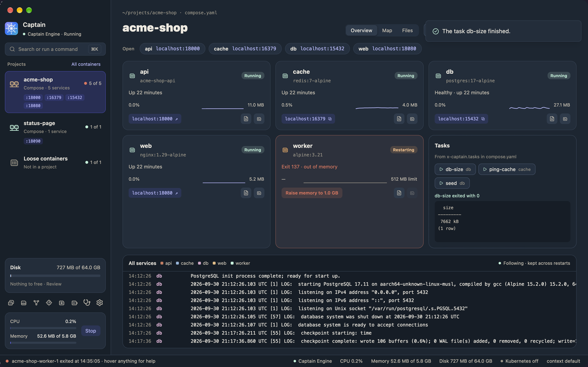
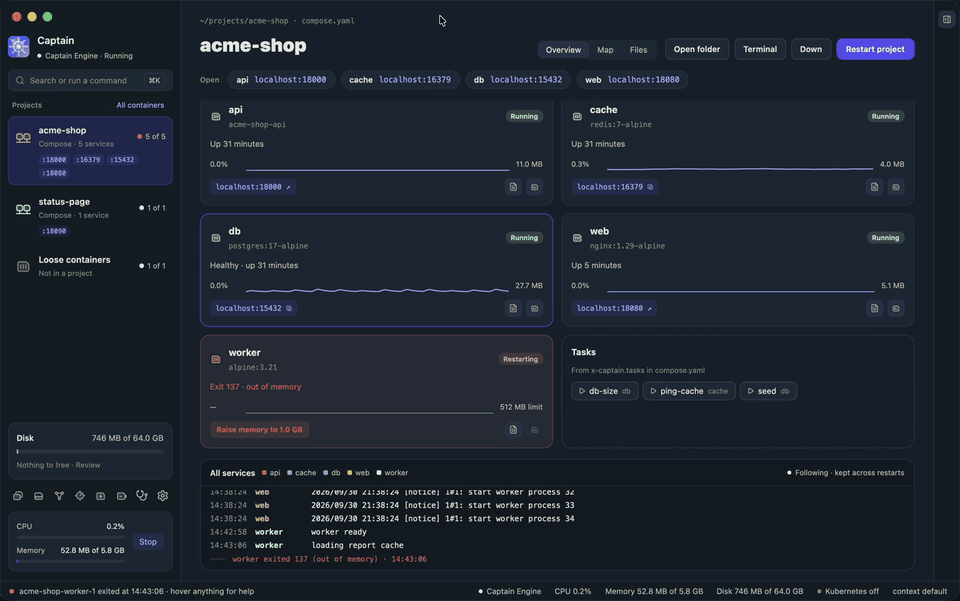
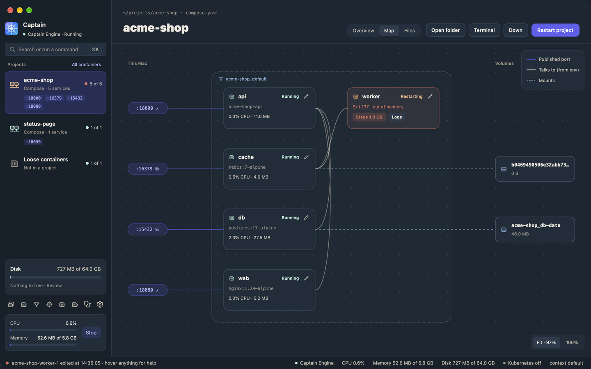

# Projects and tasks

A project is a Compose project, the containers that `docker compose up` started from one Compose file. Captain groups them by the labels that Compose puts on each container. Each project has an entry in the sidebar and a project page.



Kubernetes namespaces and loose containers also get a page. Their pages have no header buttons, no Open row, and no tasks, because those need a Compose project.

The project buttons and tasks run the `docker compose` CLI. Captain.app includes it.

## The header

- **Open folder** opens the project folder in Finder.
- **Terminal** opens a tab in Captain's terminal panel, in the project folder. Its `docker` commands use the engine that Captain shows. See [The terminal panel](getting-started.md#the-terminal-panel).
- **Down** stops and removes the project's containers. Captain asks first. Volumes and images stay.
- **Restart project** restarts every service. While nothing runs, the button is **Up**, which runs `docker compose up`.

After **Down**, the page stays open, so you can click **Up** again.

## The Open row

The Open row has one pill per published port, with the service name and `localhost:PORT`.

- A click on a web port opens `http://localhost:PORT` in your browser.
- A click on a database, cache, or broker port copies `localhost:PORT` to the clipboard. A browser cannot show these ports.

The port inside the container decides. These container ports copy the address:

| Port | Service |
|------|---------|
| 1433 | SQL Server |
| 1521 | Oracle |
| 2181 | ZooKeeper |
| 3306 | MySQL |
| 4222 | NATS |
| 5432 | Postgres |
| 5672 | RabbitMQ |
| 6379 | Redis |
| 9042 | Cassandra |
| 9092 | Kafka |
| 11211 | Memcached |
| 27017 | MongoDB |

Every other port opens in the browser. The same rule applies to **Open Ports** in the menu bar menu and to `open` in the command palette.

## Service cards

Each service has a card with its image, its state, a note, CPU and memory, and its ports.

The note says what happened last:

- "Up 3 hours", or "Healthy · up 3 hours" for a service with a health check.
- "Health: failing" when the health check fails.
- "Exit 137 · out of memory · 3 times in 2 min" when the service crashed. The count covers the last two minutes.

A card can also show **Resume** for a paused container, and **Raise memory** after an out-of-memory kill.

### Raise memory

When the kernel stops a container because it used all its memory, the card offers **Raise memory to** *size*. The size is twice the old limit, and at least 512 MB.



The button changes the running container, like `docker update --memory`. The change lasts until Compose creates the container again, for example after you edit the Compose file and run `docker compose up`. To keep the new limit, put it in the Compose file:

```yaml
services:
  worker:
    mem_limit: 512m
```

## The project log

The project log shows every service in one list, sorted by time. Each line has a colored service tag.

- The log follows new lines. Scroll up to pause it. Scroll to the end to follow again.
- The log keeps its lines when a service restarts.
- When a service exits, a red line marks it, for example "worker exited 137 (out of memory) · 12:07:11". These restart markers show where each crash happened.
- The log keeps the last 2000 lines.

To see one service's log with search and filters, click the service's card and open the **Logs** tab.

## Tasks

Tasks are named commands that run in a service, such as a database migration. You write them in the Compose file under the top-level `x-captain` key. Compose ignores keys that start with `x-`, so the file still works everywhere.

```yaml
x-captain:
  tasks:
    migrate:
      service: api
      command: npm run migrate
    seed:
      service: api
      command: ["node", "scripts/seed.js"]
    psql:
      service: postgres
      command: psql -U app -c "select count(*) from users"

services:
  api:
    image: node:22
  postgres:
    image: postgres:17
```

Each task needs two keys:

- `service`: the Compose service to run the command in.
- `command`: a string or a list. Captain runs a string with `sh -c`, so pipes and `&&` work. Captain runs a list as it is, without a shell.

The Tasks card shows one button per task, sorted by name. Hover a button to see its command in the status bar.

1. Start the project. A task runs in a running container.
2. Click the task's button.
3. Wait for the task to end. The card then shows the exit code and the last lines of output.

Captain runs `docker compose exec -T SERVICE COMMAND`. The output shows when the task ends, not while it runs.

Captain reads the tasks with `docker compose config`, so variables from `.env` work in the command. If a task has no service or no command, the card shows a problem line for it. With no tasks, the card shows one line with a link to this section.

## The Map tab

Click **Map** in the project header to see how the services connect. Click **Overview** to go back to the cards.



The map has three columns:

1. **This Mac.** One pin per published port, next to the service it reaches.
2. **Networks.** One dashed lane per network, with its services. A service on several networks sits in the lane of its first network by name. Services with no network, or not read yet, sit in **No network**.
3. **Volumes.** One node per named volume that a service mounts. Bind mounts do not show.

The lines follow the legend:

- **Published port**: a port on this Mac reaches a service.
- **Talks to (from env)**: a service's environment names another service.
- **Mounts**: a service mounts a volume.

A service talks to another when a value in its environment has the other service's name as a host. For example, `DATABASE_URL=postgres://app@postgres/app` and `REDIS=redis:6379` both count. A bare name counts only when the variable name contains `HOST`, `ADDR`, `SERVER`, `URL`, `URI`, `DSN`, `ENDPOINT`, or `BROKER`. So `POSTGRES_USER=postgres` does not count.

Click **Fit** to fit the map to the page width. Click **100%** to see it at full size. Click a service to open the inspector.

## Staged changes

On the map, you can collect changes to limits and restart policies, check them in one list, and apply them together. Nothing changes until you apply.

### What can change without a new container

Docker changes these values in a running container, with `docker update`:

- the memory limit, from 64 MB to 16 GB,
- CPUs, in steps of 0.5,
- the restart policy: `no`, `always`, `unless-stopped`, or `on-failure`.

Environment variables, ports, the image, mounts, and networks need a new container. Change them in the Compose file and run `docker compose up`.

### Stage and apply

1. Click the pencil button on a service.
2. Change **Memory limit**, **CPUs**, or **Restart policy**.
3. Click **Stage**. The service gets a "staged" tag, and the header shows a pill such as "3 staged changes".
4. Check the list under **Staged changes**. Each row shows the old and the new value. To drop one row, click its remove button. To drop all, click **Discard**.
5. Click **Apply · update N containers**.

Each container gets a message. Applied rows leave the list. Failed rows stay, with the error. The engine refuses:

- a memory limit below what the container uses now,
- a restart policy for a container started with `--rm`.

After an out-of-memory kill, the service shows **Stage 512 MB** (or twice its old limit). Click it to stage the new limit.

Staged changes live only in the open window. Captain forgets them when it quits.

Like **Raise memory**, applied changes last until Compose creates the container again. To keep them, put them in the Compose file.
