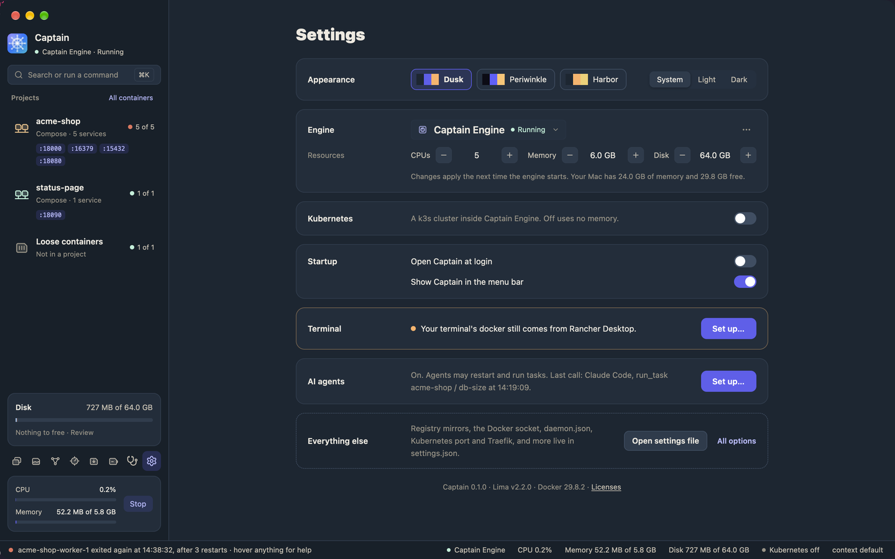

# Settings

Captain has two places for settings:

- **The Settings page** has the settings that most people change.
- **The settings file**, `settings.json`, has every option. The page and the file change the same settings.

## The Settings page

Click the Settings button at the bottom of the icon rail. The page has these sections.



### Appearance

Pick a theme: **Dusk**, **Periwinkle**, or **Harbor**. Then pick **System**, **Light**, or **Dark**. **System** follows the macOS appearance.

### Engine

The state of Captain Engine, and its resources:

- **CPUs**
- **Memory**
- **Disk**

Each click on **CPUs** or **Memory** saves the new value. A stopped engine gets it at once. A running engine keeps its old values until it restarts, and a **Restart to apply** row says what changes, for example "Captain Engine runs with 4 CPUs and 6.0 GB memory; the new settings are 6 CPUs and 8.0 GB memory." Click **Restart** to apply it. The same row shows when the Docker daemon settings changed.

The disk grows as it fills, up to its size. It can grow but not shrink:

1. Click **+** on **Disk** until it shows the size you want. Nothing is saved yet.
2. Click **Grow…**. Captain asks "Grow the disk to 96.0 GB? A disk can grow but not shrink."
3. Click **Grow** to save the size, or **Cancel** to keep the disk as it is.

**−** does not go below the size of the disk now. A running engine gets the larger disk when it restarts.

Click the engine's name to switch engines. The menu lists Captain Engine, the other engines on this computer, your Docker contexts, and **Add a remote host…** for an `ssh://` host.

With Captain Engine, the **…** menu has **Start**, **Stop**, **Restart**, **Bring data from another engine…**, **Show engine files**, and **Reset engine…**. The Engine card on the [Diagnostics](troubleshooting.md) page also starts, stops, and restarts the engine.

### Kubernetes

A switch for the k3s cluster in Captain Engine. Off uses no memory. See [Kubernetes](kubernetes.md).

### Startup

- **Open Captain at login.**
- **Show Captain in the menu bar.** Without the icon, closing the window quits Captain.

### Terminal

This row says where your terminal's `docker` comes from, for example "Your terminal's docker still comes from Rancher Desktop." Click **Set up…** to link Captain's tools, put them on your `PATH`, and make `docker` use Captain Engine. See [Set up your terminal](moving-from-docker-desktop-or-rancher.md#set-up-your-terminal).

### AI agents

This row says whether AI agents can use Captain, which actions they may run, and their last call. Click **Set up…** to turn agent tools on, choose the actions, and connect Claude Code, Codex, Cursor, and other agents. See [AI agents](agents.md).

### Everything else

Registry mirrors, the Docker socket, `daemon.json`, the Kubernetes port and Traefik, and the other options are in the settings file.

- **Open settings file** opens `settings.json` in your default editor for JSON files.
- **All options** lists every option, its default, and what it does.

The bottom of the page shows the versions of Captain, Lima, and Docker, and **Licenses**.

## The settings file

The file is at:

```text
~/Library/Application Support/Captain/settings.json
```

It holds only the options that you changed. Captain keeps the defaults, so the file stays short, and a new default in a later version reaches you.

Captain creates the file at its first start. The new file has a note at the top, the `$schema` line, and a few examples in comments. An example does nothing until you remove the `//` in front of it.

After some changes, a file can look like this:

```jsonc
{
  "$schema": "./settings.schema.json",
  "version": 2,

  "theme": "harbor",

  // Pulls try this mirror before Docker Hub.
  "engine_daemon": {
    "registry_mirrors": ["https://mirror.gcr.io"]
  },

  "kubernetes": {
    "traefik": false
  },

  "stop_engine_on_quit": false,
  "weekly_build_cache_cleanup": true
}
```

The [settings reference](../reference/settings.md) lists every option.

### Comments

Write `//` comments to say why you set a value. When the Settings page or `captain set` changes a value, Captain edits that value in place. Your comments stay, also inside `engine_resources` when you change one of its values.

### Autocomplete in your editor

Captain writes `settings.schema.json` next to the file. The `$schema` line points your editor at it. Zed and VS Code then give you:

- completions for option names and values,
- the description of an option when you hover it,
- a warning for a wrong name or value.

If your editor marks the comments as errors, set the file's language to JSON with Comments (`jsonc`).

### When changes apply

Captain watches the file and applies it when you save. You do not need to restart Captain.

Engine options, such as the resources, the Docker daemon, and Kubernetes, apply the next time Captain Engine starts. While the engine runs with other resources or Docker daemon settings, the Engine section shows **Restart to apply**. Captain says so when you save. If you change the resources while Captain takes or restores a snapshot, Captain applies them when the snapshot is done, before it starts the engine again. A restore keeps the snapshot's resources instead.

### Mistakes

If the file has a mistake, Captain keeps the last good settings and shows an error that names the line. For example:

```text
settings.json line 9: kubernetes.port must be 1–65535. Captain keeps the last good settings.
```

Each value of `engine_resources` must be at least its minimum: 1 CPU, 2 GiB of memory, and a 16 GiB disk. A value below that is a mistake, and Captain names its line.

A file that is not one object, such as a list, is a mistake too. Captain never writes over it.

Fix the line and save again.

### From the terminal

`captain set` changes the same file. Quit Captain first.

```sh
captain list-settings
captain set memory 8
captain set stop-engine-on-quit false
```

`captain set disk` refuses a size smaller than the disk now, because a disk cannot shrink.

See [The command line](cli.md).
