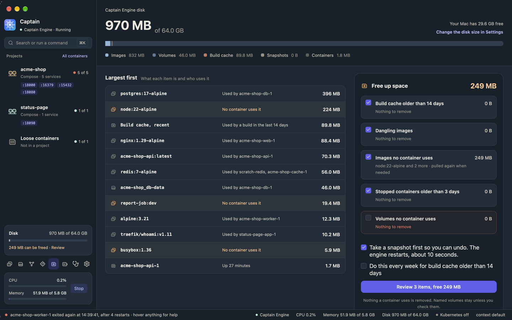
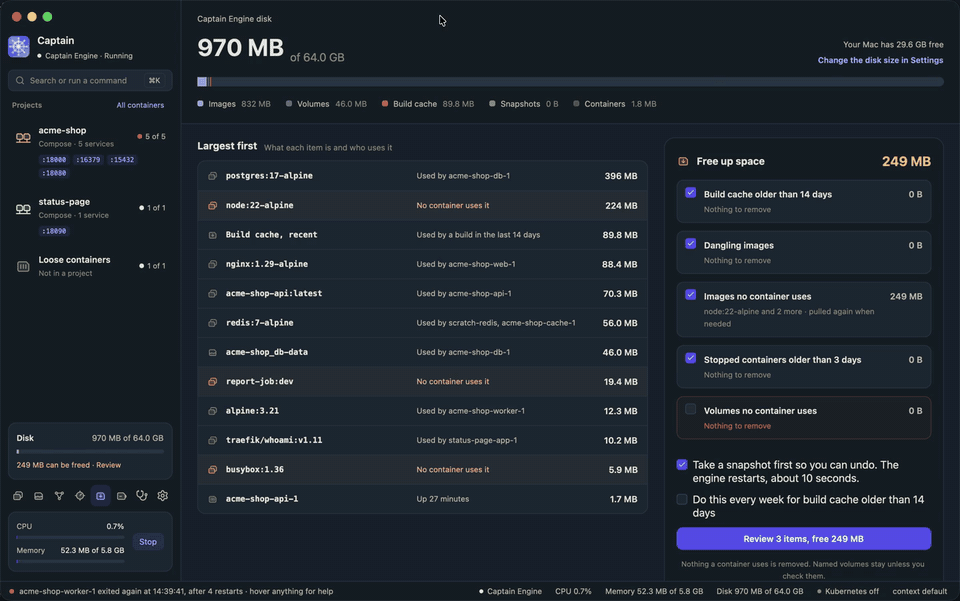

# Storage

The Storage page shows what fills the engine disk, who uses each large item, and what you can remove. Open it with the disk number in the sidebar status line, the Storage button in the icon rail, or `disk` in the command palette.

## The disk bar

With Captain Engine, the header shows the bytes in use out of the disk size, for example "18.2 GB of 64 GB", and the free space on your Mac. **Change the disk size in Settings** opens Settings. The disk grows as it fills, up to its size. It cannot shrink.

With another engine, the header shows only the bytes in use.

The bar splits the disk into these categories:

| Category | What it is |
|----------|------------|
| Images | The images on the engine. Layers that several images share count once. |
| Volumes | Named volumes and the data in them. |
| Build cache | What `docker build` keeps to make the next build faster. A build makes it again. |
| Snapshots | Saved copies of Captain Engine (Captain Engine only). See [Snapshots](snapshots.md). |
| Containers | The files that containers wrote outside their volumes. |

## Largest first

The list shows the 12 largest items, with a note on who uses each one:

- "Used by api, worker and 2 more": the containers, running or stopped, that use an image or a volume.
- "No container uses it": a tagged image that no container uses.
- "No tag, not used": dangling images, in one row.
- "Not used since Sep 12": build cache that no build used in 14 days.
- "Not used · may hold data": a volume that no container mounts.

Rows that the cleanup can remove have a warning color.

## Free up space

**Free up space** has five groups. Each has a checkbox, its size, and a note.

| Group | Checked at first | What it removes |
|-------|------------------|-----------------|
| Build cache older than 14 days | Yes | Build cache that no build used in 14 days. |
| Dangling images | Yes | Images with no tag that no container uses. |
| Images no container uses | Yes | Tagged images that no container uses. A pull or a run gets them again. |
| Stopped containers older than 3 days | Yes | Stopped containers created more than 3 days ago, with their files. |
| Volumes no container uses | No | Volumes that no container mounts. Their data is lost. |

The cleanup never removes:

- an image that a container uses, running or stopped,
- a volume that a container mounts,
- a running container,
- build cache that a build used in the last 14 days,
- build cache that BuildKit marks as internal,
- snapshots.

To clean up:

1. Check the groups you want. The button shows the total, for example **Review 18 items, free 6.1 GB**.
2. Click the button. A dialog lists every item that the cleanup removes.
3. Click **Remove N items and free X**, or **Cancel**.

Captain removes images by ID, build cache by record, volumes by name, and containers by ID. It removes only the items in the dialog. If a container starts to use an item after you open the dialog, Captain does not remove that item. An image with tags in more than one repository stays, and the message names it. A message reports the bytes freed and any item that was not removed.

If Captain connects to a different engine before the cleanup starts, it removes nothing.

## Take a snapshot first

With Captain Engine, the option **Take a snapshot first so you can undo** is on. Before the cleanup, Captain:

1. stops Captain Engine,
2. saves a snapshot named "Before cleanup" and the date,
3. starts Captain Engine and waits for it,
4. removes the items.

The engine restarts, so your containers stop for about 10 seconds. If the snapshot fails, or the engine does not come back within 3 minutes, Captain removes nothing.

To undo the cleanup, restore the snapshot on the [Snapshots](snapshots.md) page. Delete the snapshot when you no longer need it, because it holds the removed items and uses disk.

## Weekly build-cache cleanup

Check **Do this every week for build cache older than 14 days** to clean the build cache once a week. The setting is `weekly_build_cache_cleanup` in the [settings file](settings.md). It is off by default.

While the engine runs, Captain checks once an hour. When 7 days passed since the last run, it removes build cache that no build used in 14 days. It removes nothing else. The run shows in Captain's log, not in the window.
