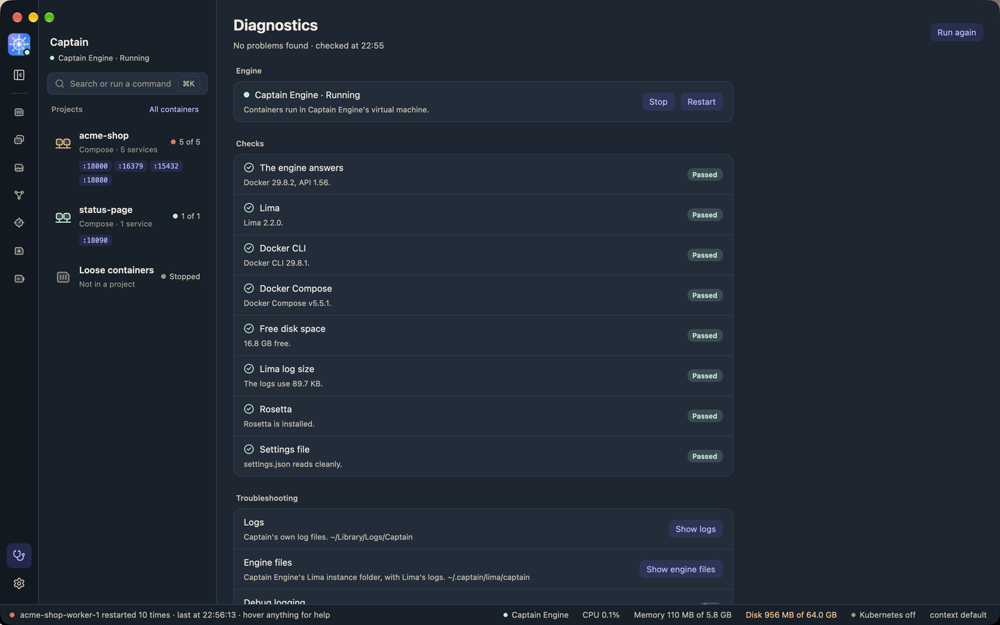

# Troubleshooting

Start with the Diagnostics page. Click the Diagnostics button at the bottom of the icon rail. The button shows a red count while a check fails.



## The Diagnostics page

The **Engine** card at the top shows the engine and its state, for example "Captain Engine · Running". With Captain Engine it has the engine's controls:

- **Start**, while the engine is stopped or failed.
- **Set up**, while the engine is not set up. Captain downloads and creates its VM.
- **Stop** and **Restart**, while the engine runs. Running containers stop with it.

A spinner shows while the engine starts or stops. With another engine, the card shows its name and socket, and **Use Captain Engine** switches to Captain Engine. Captain does not start or stop another engine.

To open Diagnostics, you can also click the app icon in the icon rail, the engine header in the sidebar, or the engine segment in the status bar.

The **Checks** card is under the Engine card. Each check has a state:

- **Passed**: nothing to do.
- **Warning**: something works less well, or may fail later.
- **Failed**: something does not work.
- **Not applicable**: the check does not apply to this Mac or this engine. With another engine, the Lima, Lima log size, and Rosetta checks do not apply.

A check with a fix has a button. Captain runs the checks at launch, when the engine starts, stops, or connects, and when you click **Run again**.

The menu bar menu shows the worst failed check with the same fix. The Dock icon counts the failed checks.

## The checks

### The engine answers

Captain asks the engine for its version. The check passes when the engine answers within 5 seconds. It shows the Docker and API versions.

| Detail | What it means | Fix |
|--------|---------------|-----|
| "Captain Engine runs, but its Docker socket does not answer." | The VM runs, but Docker in it does not answer. This often happens after the Mac sleeps. It is a known Lima issue ([lima#5420](https://github.com/lima-vm/lima/issues/5420)). | Click **Restart Captain Engine**. |
| "Captain Engine is stopped." | The engine does not run. | Click **Start Captain Engine**. |
| "Captain Engine is not set up." | The VM does not exist yet. | Click **Start Captain Engine**. The first start creates it. |
| "Captain Engine failed: …" | The last start failed. The detail gives the reason. | Click **Start Captain Engine**. If it fails again, click **Show logs** and **Show engine files**, and read the newest log. |
| "Captain Engine is starting or stopping." | A start or stop runs. This is a warning. | Wait. |
| "The engine does not answer: …" | Another engine does not answer. | Start that engine, or choose another one. |

### Lima

Captain Engine runs in a [Lima](https://lima-vm.io) VM, and needs Lima 2.2.0 or newer. Older versions lose port forwarding after many connections ([lima#5210](https://github.com/lima-vm/lima/issues/5210)).

| Detail | Fix |
|--------|-----|
| "limactl is not installed. Captain Engine needs it." | Click **Copy command**, then paste `brew install lima` into a terminal. |
| "Lima X is too old." | Click **Copy command**, then paste `brew upgrade lima` into a terminal. |
| "Captain cannot read the Lima version." | A warning. Reinstall Lima. |

`Captain.app` includes Lima. You see these failures only with a build that has no tools, such as `cargo run`.

### Docker CLI

Compose projects, tasks, and builds need the `docker` CLI. If it is missing, the check warns. Click **Copy command** and run `brew install docker`, or use `Captain.app`, which includes it.

### Docker Compose

The project buttons and tasks need the Compose plugin. If `docker compose version` fails, the check warns. `Captain.app` includes Compose.

### Free disk space

The check warns when the disk with your home folder has less than 10 GB free. Images and volumes need room. Free space on your Mac, or use [Storage](storage.md) to clean up the engine. This check does not run on Windows yet.

### Lima log size

Lima writes its logs into `~/.captain/lima/captain`, and nothing limits their size. The check warns above 100 MB.

1. Click **Show engine files**.
2. Stop Captain Engine. Lima keeps the logs open while the VM runs.
3. Delete the `*.log` files.
4. Start Captain Engine.

### Rosetta

On an Apple silicon Mac, Captain Engine uses Rosetta to run `x86_64` (Intel) images. Without Rosetta, those images run slowly, and the first start can wait at "Installing rosetta" ([lima#1202](https://github.com/lima-vm/lima/issues/1202)).

Click **Copy command**, then paste this into a terminal:

```sh
softwareupdate --install-rosetta --agree-to-license
```

## Logs

The **Troubleshooting** card on the Diagnostics page has these controls:

- **Show logs** opens Captain's log folder, `~/Library/Logs/Captain`. The file is `captain.log`. Console.app can read it too. At 10 MB, the file moves to `captain.log.1`, so the logs use at most 20 MB.
- **Show engine files** opens `~/.captain/lima/captain`, Captain Engine's Lima folder, with Lima's own logs. `ha.stderr.log` has most start errors.
- **Debug logging** writes more detail to `captain.log` at once, without a restart. Turn it on before you reproduce a problem, and turn it off after. The setting is `debug_logging` in the [settings file](settings.md).

To report a problem, attach `captain.log` and describe what you did.

## Other messages

| Message | What to do |
|---------|------------|
| "Captain is already running." | Another Captain window runs. Use the menu bar icon to open it. |
| "Captain Engine is starting in another Captain process." | The `captain` command or the app is starting or stopping the engine. Wait until it ends. |
| "Captain is running. Change this in Settings, or quit Captain first." | `captain set` and other commands that change settings need the app to be closed. |
| A start that names a `.restore-backup` folder | A snapshot restore did not finish. Captain keeps the old engine files in that folder. Move the folder out of `~/.captain/lima/captain`, then start again. |

## The engine does not answer after sleep

If containers stop answering after your Mac wakes up, Diagnostics usually shows "Captain Engine runs, but its Docker socket does not answer." Click **Restart Captain Engine**, or run `captain restart`. Your containers start again if their restart policy says so.
